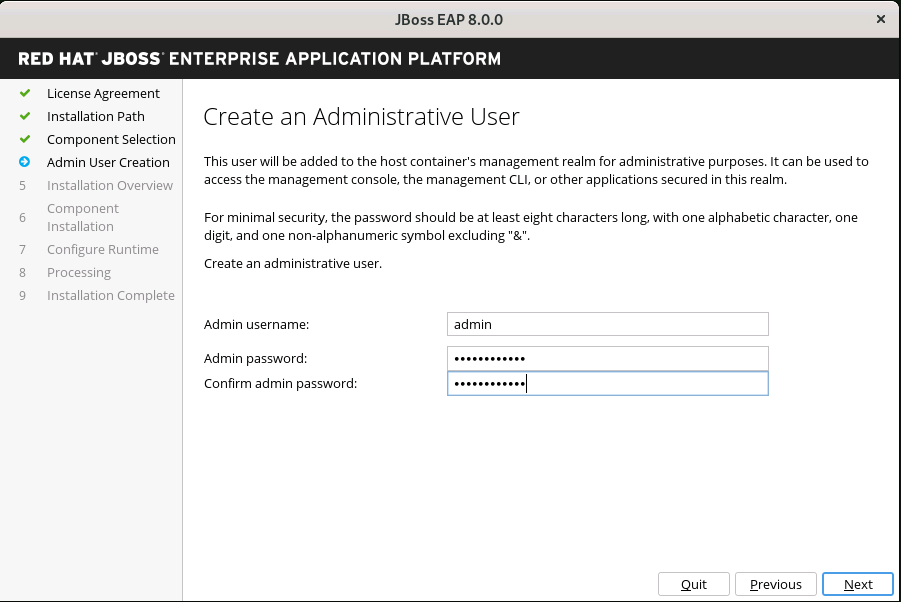
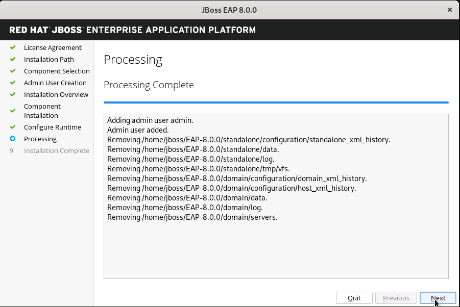

= Installing JBoss EAP

Brief blurb about how JBoss EAP offers multiple ways to install...

== Pre-requisites

* You have created an account on the Red Hat Customer Portal to download JBoss EAP files.
* You have installed a https://access.redhat.com/articles/6961381[Red Hat supported OpenJDK 17]
* Recommended to create a separate *jboss* user account with no shell access (/sbin/nologin)
* Recommended to download all installation file under /opt partition. Ensure there is enough space under /opt partition (minimum 800MB).
You have reviewed JBoss EAP 8.0 supported configurations.
* You have access to the internet.

== Red Hat JBoss Enterprise Application Platform 8 Installation Methods

You can install JBoss EAP 8.0 by using one of the following installation methods:

* *JBoss EAP using the Zip file*
* *JBoss EAP using the JAR installer*
* *JBoss EAP using archive installation method*
* *JBoss EAP by using the RPM installation method*

== Installing JBoss EAP using the Zip file

* This method can also be called jboss-eap-installation-manager installation method.
* In this method, the JBoss EAP 8 is distributed as a zip file that you can extract and execute on an operating system (OS) with  OpenJDK 17 installed.
* The zip file contains all the libraries, configuration files, and scripts needed to start JBoss EAP, without further customization.

== Installing JBoss EAP using the JAR installer

* This method can also be called the GUI installer installation method.
* In this method, the jar file is a Java based application that is responsible for providing a step-by-step way to customize the environment setup.
* Due to its portable nature, you can use it on multiple platforms and it requires OpenJDK 17 installed on the host OS.
* It can be run using either a graphical interface or a text based console.
* Due to its flexible nature, the installer can install JBoss EAP by using a response file, with all the options passed as an XML file.

== Installing JBoss EAP using archive installation method

--TBA--

== Installing JBoss EAP by using the RPM installation method

* JBoss EAP 8 is available as an RPM package for users with a valid subscription to the JBoss Enterprise Application Platform sub-channel, in the JBoss Enterprise Application Platform group. * The yum command downloads all the RPMs to the host OS, and automatically installs all the files needed to start and manage JBoss EAP.
* The RPM installation method is only valid for Red Hat Enterprise Linux (RHEL) operating system.
 
== Starting JBoss EAP

Provide a brief explanation of different flags for the _standalone.sh_ script, especially *-b* flag....default is bound only to localhost (127.0.0.1) for security.

NOTE: Mention that the installation can be automated using a response file (kinda like kickstart), and that this will be covered in the second course in the path (_Advanced JBoss EAP Administration_)

NOTE: Mention that the installation can be automated using _Ansible Middleware_, and that this will be covered in the second course in the path (_Advanced JBoss EAP Administration_)

NOTE: Make sure you talk about how to start JBoss EAP as an OS service using systemd on RHEL 9 and other Linux's. Provide links to EAP systemd unit files in the code repo.

NOTE: Talk about which ports to open in the firewall.

== Uninstalling JBoss EAP

Brief blurb about uninstall.....

== References

* https://access.redhat.com/documentation/en-us/red_hat_jboss_enterprise_application_platform/8.0/html/red_hat_jboss_enterprise_application_platform_installation_methods/index[Red Hat JBoss Enterprise Application Platform Installation Methods]

== Lab 1: Installing JBoss EAP using the Zip file

* Install OpenJDK 17 if not already installed:
+
[subs="+quotes,+macros"]
----
[root@localhost ~]# sudo yum install java-17-openjdk -y
----

* Download the JBoss EAP zip file from https://access.redhat.com/jbossnetwork/restricted/listSoftware.html?product=appplatform&downloadType=distributions[`Red Hat JBoss Enterprise Application Platform 8.0 Installation Manager`].

* Copy the zip file under `/opt`.
+
[subs="+quotes,+macros"]
----
[root@localhost ~]# cp ~/Downloads/jboss-eap-8.0.0-installation-manager.zip /opt
----

* Swtich to /opt and uncompress the zip file:
+
[subs="+quotes,+macros"]
----
[root@localhost opt]# unzip /opt/jboss-eap-8.0.0-installation-manager.zip
----

* Switch to the uncompressed folder:
+
[subs="+quotes,+macros"]
----
[root@localhost opt]# cd jboss-eap-installation-manager-1.1.6.Final-redhat-00001/bin
----

* Install JBoss EAP by running the following command:
+
[subs="+quotes,+macros"]
----
[root@localhost bin]# ./jboss-eap-installation-manager.sh install --profile eap-8.0 --dir eap-8
Installing profile: eap-8.0
Using channels:
# eap-8.0
  manifest: org.jboss.eap.channels:eap-8.0
_...output omitted..._
----
+
Review the end user license agreement, and follow the rest of the prompts to install JBoss EAP.
+
[subs="+quotes,+macros"]
----
Accept the agreement(s) [y/N]y
Feature-packs resolved.
Packages installed.
Downloaded artifacts.
JBoss modules installed.
_...output omitted..._
----

* Start the JBoss EAP using the start script present under `/opt/jboss-eap-installation-manager-1.1.6.Final-redhat-00001/bin/eap-8/bin/standalone.sh`
+
[subs="+quotes,+macros"]
----
[root@localhost ~]# /opt/jboss-eap-installation-manager-1.1.6.Final-redhat-00001/bin/eap-8/bin/standalone.sh
----

* Navigate to the JBOSS console at http://localhost:8080

[NOTE]
--
The jboss-eap-installation-manager is also supported on Microsoft Windows. To use this script on a Windows machine, replace the .sh with .bat in your script.
--

== Lab 2: Installing JBoss EAP using the JAR installer

* Install OpenJDK 17 if not already installed:
+
[subs="+quotes,+macros"]
----
[root@localhost ~]# sudo yum install java-17-openjdk -y
----

* Install the GUI if not already installed on RHEL 9:
+
[subs="+quotes,+macros"]
----
[root@localhost ~]# sudo yum install java-17-openjdk -y
----

* Create a user named jboss with no shell access:
+
[subs="+quotes,+macros"]
----
[root@localhost ~]# useradd -s /sbin/nologin jboss
----

* Download the JBoss EAP zip file from https://access.redhat.com/jbossnetwork/restricted/listSoftware.html?product=appplatform&downloadType=distributions[`Red Hat JBoss Enterprise Application Platform 8.0 Installer`].

* Open a terminal instance and navigate to the directory containing the downloaded JBoss EAP installer file.
+
[subs="+quotes,+macros"]
----
[root@localhost ~]# cd Downloads/
[root@localhost Downloads]# ls -l jboss-eap-8.0.0-installer.jar
-rw-r--r--. 1 root root 28141889 Apr  1 09:35 jboss-eap-8.0.0-installer.jar
----

* Run the graphical installer using the following command:
+
[subs="+quotes,+macros"]
----
[root@localhost Downloads]# java -jar jboss-eap-8.0.0-installer.jar
----

* Choose your preferred language for the installer, and then click OK.

*  Agree with the prompt for The EULA for RED HAT JBOSS MIDDLEWARE by selecting "I accept the terms of this license agreement", and then click Next.

* Select the installation path or choose a Maven source repository for JBoss EAP, and then click Next.
+

* Select the components to install. Required components are disabled for deselection. Select `Next`:
+

* Set the admin password and select `Next`:
+

* Confirm the installation overview and select `Next`:
+

* The component installation will take around 5 mins, once completed, select `Next`:
+
image::assets/images/complete.png[align="center"]

* Select `Perform default configuration` as shown in below screenshot:
+

* Once the progressing completes, select `Next`:
+

* Finally, select `Done`:
+

* Start the JBoss EAP using the start script present under `/home/jboss/EAP-8.0.0/bin/standalone.sh`
+
[subs="+quotes,+macros"]
----
[root@localhost ~]# /home/jboss/EAP-8.0.0/bin/standalone.sh
----

* Navigate to the JBOSS console at http://localhost:8080

== Lab 3: Installing JBoss EAP using other methods....

. Step 1
. Step 2
.. Step 2.a
.. Step 2.b
. Step 3